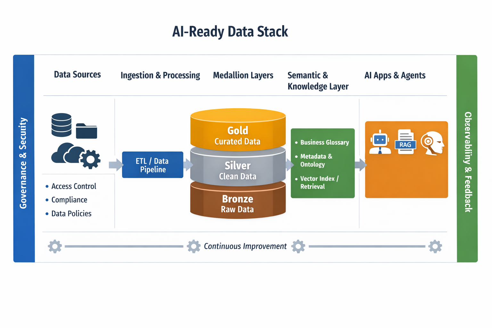

# DataMindAI — AI Readiness Starter Kit  
*(Databricks + VS Code)*

---

## 🚀 What This Repository Is

This repository is a **hands-on companion** to the blog and video series:

**AI-Ready Data: Why Most AI Projects Fail Before Production**

It provides **runnable notebooks, sample data, and practical patterns** that demonstrate how to design **decision-grade data foundations for AI** — not just dashboards or demos.

You’ll learn how to build data systems that AI can **trust**, **understand**, **operate safely**, and **improve over time**.

---

## 🎯 The Four Pillars of AI Readiness

This repository is organised around the **four foundational pillars required for production-grade AI**:

### 1️⃣ Trust — Data Quality & Reliability
- Data contracts  
- Validation at ingestion and transformation  
- Quality gates and monitoring  
- Preventing *“confident hallucinations”*

### 2️⃣ Control — Governance & Security
- Clear ownership and stewardship  
- Policy-based access controls  
- Auditability and compliance  
- Row- and column-level enforcement  

### 3️⃣ Context — Semantics & Metadata
- Business glossary and definitions  
- Metadata registry  
- Lineage and provenance  
- *“RAG-ready”* curated knowledge bases  

### 4️⃣ Feedback — Closed-Loop Learning
- Capturing user corrections  
- Monitoring data and behaviour drift  
- Measuring decision outcomes  
- Continuous improvement of AI systems  

---

## 🧠 Architecture Overview

The notebooks align to the **AI-Ready Data Stack**:

- **Data Sources → Ingestion & Processing**
- **Medallion Architecture** (Bronze / Silver / Gold)
- **Semantic & Knowledge Layer**
- **AI Applications & Agents**

**Governance, Security, Observability, and Feedback** span the entire stack.

> 

---

## ⚡ Quick Start — Local (VS Code)

### 1️⃣ Create and activate a virtual environment

**Windows (PowerShell):**
```powershell
python -m venv .venv
.venv\Scripts\Activate.ps1
2️⃣ Install dependencies

pip install -r requirements.txt
3️⃣ Run the notebooks
Open the notebooks in notebooks/ and run them top-to-bottom.

☁️ Quick Start — Azure Databricks
1️⃣ Create a cluster
DBR 13+ recommended

2️⃣ Import notebooks

Workspace → Import → Select .ipynb files from notebooks/
3️⃣ Install required libraries

Cluster → Libraries → Install New → PyPI
Install:

great_expectations

scikit-learn

scipy

duckdb

pyarrow

4️⃣ Upload sample data
Choose one option:

Option A — DBFS


dbfs:/FileStore/datamindai-ai-readiness/
Option B — Unity Catalog Volume


/Volumes/<catalog>/<schema>/<volume>/datamindai-ai-readiness/
5️⃣ Configure notebooks
In each notebook, set:


BASE_PATH = "your chosen path here"
📂 Repository Contents
📓 Notebooks
01_trust_data_quality.ipynb
Data contracts, Great Expectations, quality gates

02_control_governance_security.ipynb
Ownership, policy checks, audit logs, row-level filtering

03_context_semantics_metadata.ipynb
Glossary, metadata registry, RAG-ready knowledge base, retrieval demo

04_feedback_closed_loop.ipynb
User feedback capture, drift monitoring, simple retraining loop

🗄 Data
data/raw/
Intentionally imperfect data (duplicates, missing values, inconsistent codes)

data/curated/
Silver / Gold-style outputs produced by the notebooks

🧩 Code
src/
Helper utilities used across notebooks

📄 Docs
docs/
Short how-to guides and explanations

📖 Blog & Video Series
📝 Blog
AI-Ready Data: Why Most AI Projects Fail Before Production
👉 https://datamindaiwithahmed.com/ai-ready-data-why-most-ai-projects-fail-before-production/

🎥 YouTube Playlist
AI Readiness for the Enterprise — Full Series
👉 https://www.youtube.com/playlist?list=PLsL9JQ2lLNZIQmqi_5KHs01-vd8np_pDD

This repository aligns directly with:

Introduction to the 3-Part Series

AI Readiness (Part 1)

Business Readiness (Part 2)

Decision Readiness (Part 3)

🧭 Who This Is For
Data Engineers

Analytics Engineers

AI / ML Engineers

Data Architects

Platform Owners

Technical leaders designing AI-ready organisations

📜 License
MIT License
Feel free to use, adapt, and extend this work in your own projects.

If you find this repository useful:

⭐ Star it on GitHub
📺 Subscribe to the YouTube channel
📝 Follow the blog for deep dives


---

